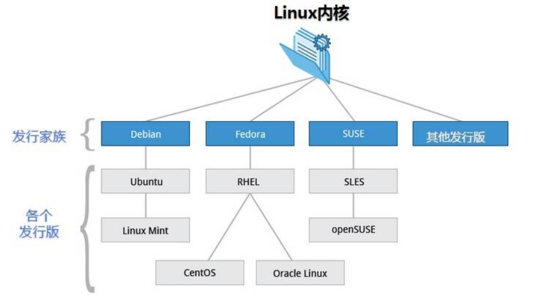
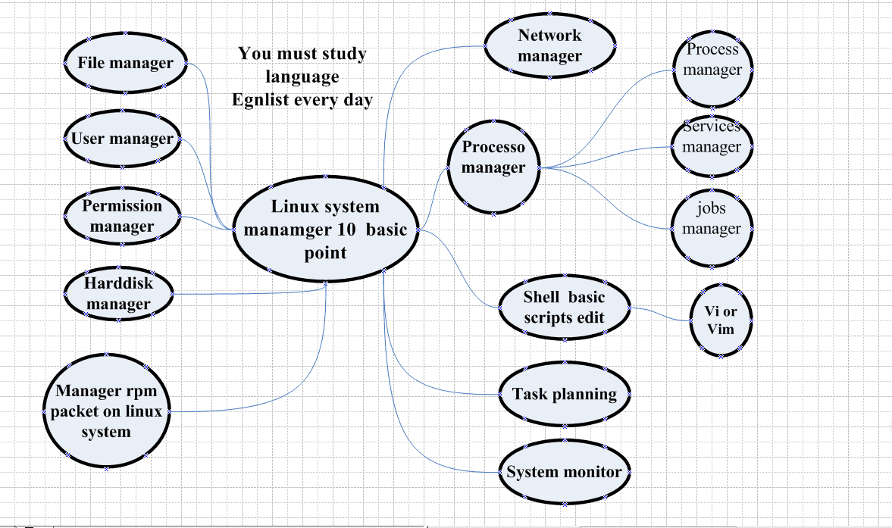

# Linux Concepts

## 1.What is Linux?

Linux 是一套开源(GNU GPL)免费的类unix操作系统, 支持多用户、多任务、多线程、多cpu, Linux安全稳定的特性使得他在服务器领域无可匹敌, JAVA应用虽然是跨平台的, 但是一般都会选择Linux作为服务器

## 2.Linux的发行版本

我们常说的Linux指的是Linux Kernel, 各大厂商基于Linux kernel与自己开发的应用软件一起打包发行的操作系统都叫做Linux操作系统. 

## 3.Linux知识点

