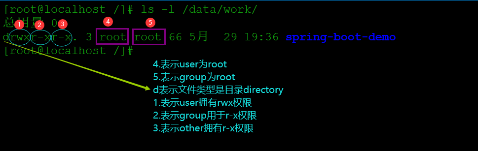

## Linux权限管理

***   *root用户拥有最高权限, 无视各种规则***

### 权限的表示方式

> linux中一切皆文件, 用户对于文件只有三种身份owner(属主), group(属主同组用户), other(其他)
>
> 文件的权限分为读(r),写(w),执行(x)    ---read, write, execute



上面的例子表示`spring-boot-demo`文件格式为directory,该目录的属主为root,属组为root,
属主user拥有rwx权限, group拥有r-x权限, 其他用户拥有r-x权限

对于普通文件而言

- **r 读权限**:    表示可以读取文件内容, 如cat命令查看文件
- **w 写权限**:    表示可以对文件进行修改, 比如vim编辑文件
- **x 执行权**:    一般脚本文件, 命令文件等

对于目录而言

- **r读权限**:     表示可以看到目录中的内容，即可以对目录执行ls命令
- **w 写权限**:     表示可以在目录中创建其他文件, 比如touch  mkdir命令
- **x 执行权**:     表示可以进入该目录，即可以对这个目录执行cd命令

### 权限的另一种表示方式

`drwxr-xr-x`后面9位分成三个部分分别表示ower, group, other的rwx权限,没有权限用[-]表示

那么把表示权限的rwx当作二进制的三位bit,有是1没有是0,那么rwx就是7r-x就是5

rwxr-xr-x就可以用数字表示为755

### 修改权限chmod

```bash
chmod [OPTION]... MODE[,MODE]... FILE...
```

OPTION: 常用到的重要选项是-R    change files and directories recursively

##### 第一种用法:

```bash
chmod [{ugoa}{+-=}{rwx}]... FILE...
```

u:所有者    g:所属组    o:其他用户    a:所有用户

+:增加权限    -:撤销权限    =:为用户赋予权限

eg: 为属主用户增加x权限, 撤回属组用户的w权限

```bash
# ll
-rw-rw-r--. 1 root root 6 5月  30 20:02 test
# chmod u+x test
# chmod g-w test
# ll
-rwxr--r--. 1 root root 6 5月  30 20:02 test
```


##### 第二种用法

```bash
chmod [mode=421] FILE...
```

eg: 赋予rwxr-xr-x(755)

```bash
# ll
-rwxr--r--. 1 root root 6 5月  30 20:02 test
# chmod 755 test
# ll
-rwxr-xr-x. 1 root root 6 5月  30 20:02 test
```