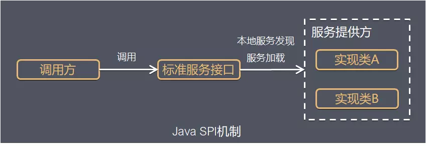
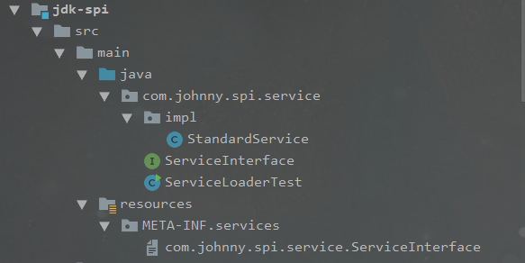

# SPI

## service provider interface

> 系统里抽象的各个模块, 往往有很多不同的实现方案, 模块之间应该依赖抽象(接口), 而不是直接依赖具体实现.一旦依赖了实现, 如果需要替换实现就需要更改代码. 为了实现在模块装配的时候能不在程序中动态指定, 这就需要一种服务发现的机制.

jdk1.6提供了这样的机制, 解耦模块之间的依赖, 使我们的模块变得可插拔.



## ServiceLoader

jdk1.6 提供了java.util.ServiceLoader让我们使用spi机制

### 使用规则 & 源码分析

#### 使用规则

1. 定义标准服务接口, 或者使用jdk或者第三方提供的
2. 提供标准服务接口的实现类, 实现类必须有无参构造器
3. classpath下META-INF/services提供配置文件,文件名为接口的全限定名,文件内容为实现类的全限定名,文件编码必须是UTF-8

#### demo



```java
public interface ServiceInterface {
    void doService();
}

public class StandardService implements ServiceInterface {
    @Override
    public void doService() {
        System.out.println("StandardService deService()...");
    }
}
public class ServiceLoaderTest {

    public static void main(String[] args) {
        // ServiceLoader.load这一步并不会加载服务实现类
        ServiceLoader<ServiceInterface> serviceLoader = ServiceLoader.load(ServiceInterface.class);
        // 只有在迭代的时候才会加载并实例化服务
        for (ServiceInterface service : serviceLoader) {
            service.doService();
        }
    }
}

// content of file(com.johnny.spi.service.ServiceInterface)
com.johnny.spi.service.impl.StandardService
```


#### ServiceLoader源码分析

成员变量

```java
    // location prefix of the provider-configuration file
    private static final String PREFIX = "META-INF/services/";
    // The class or interface representing the service being loaded
    private final Class<S> service;
    // The class loader used to locate, load, and instantiate providers
    private final ClassLoader loader;
    // The access control context taken when the ServiceLoader is created
    private final AccessControlContext acc;
    // Cached providers, in instantiation order
    private LinkedHashMap<String,S> providers = new LinkedHashMap<>();
    // The current lazy-lookup iterator
    private LazyIterator lookupIterator;
```

重要方法

```java
    public static <S> ServiceLoader<S> load(Class<S> service) {
        // 什么是context ClassLoader?
        ClassLoader cl = Thread.currentThread().getContextClassLoader();
        return ServiceLoader.load(service, cl);
    }
    
    public static <S> ServiceLoader<S> load(Class<S> service, ClassLoader loader) {
        return new ServiceLoader<>(service, loader);
    }
    
    private ServiceLoader(Class<S> svc, ClassLoader cl) {
        service = Objects.requireNonNull(svc, "Service interface cannot be null");
        loader = (cl == null) ? ClassLoader.getSystemClassLoader() : cl;
        acc = (System.getSecurityManager() != null) ? AccessController.getContext() : null;
        reload();
    }
    
    public void reload() {
        providers.clear();
        lookupIterator = new LazyIterator(service, loader);
    }
```

Providers are located and instantiated lazily .`ServiceLoader.load(Class service)`还不会去加载服务

