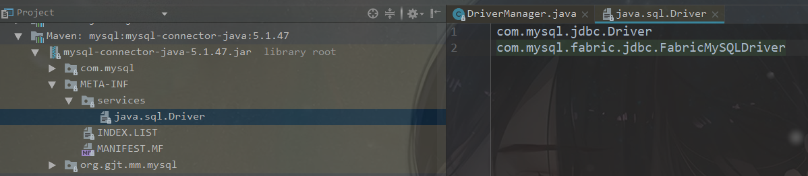

# SPI IN JDK

> jdk1.6之后java提供了spi机制Service Provider, jdbc DriveManager中就支持了这一特性.

如果你使用jdk1.6以上, mysql驱动使用的是5.1.6以上(支持了spi的版本), 使用DriverManager.getConnection获取连接之前, 不再需要手动Class.forName(...)加载驱动了.



java.sql.DriverManager 有一段static代码块, loadInitialDrivers()方法会主动加载2种方式配置的驱动

1.spi 

2.System Properties: jdbc.drivers

mysql驱动jar包中配置了spi, 所以DriverManager在加载时先执行static代码块, 会主动加载配置过的Driver实现类

```java
/**
 * Load the initial JDBC drivers by checking the System property
 * jdbc.properties and then use the {@code ServiceLoader} mechanism
 */
static {
    loadInitialDrivers();
    println("JDBC DriverManager initialized");
}

private static void loadInitialDrivers() {
    String drivers;
    try {
        drivers = AccessController.doPrivileged(new PrivilegedAction<String>() {
            public String run() {
                return System.getProperty("jdbc.drivers");
            }
        });
    } catch (Exception ex) {
        drivers = null;
    }
    // If the driver is packaged as a Service Provider, load it.
    // Get all the drivers through the classloader
    // exposed as a java.sql.Driver.class service.
    // ServiceLoader.load() replaces the sun.misc.Providers()

    AccessController.doPrivileged(new PrivilegedAction<Void>() {
        public Void run() {

            ServiceLoader<Driver> loadedDrivers = ServiceLoader.load(Driver.class);
            Iterator<Driver> driversIterator = loadedDrivers.iterator();

            /* Load these drivers, so that they can be instantiated.
             * It may be the case that the driver class may not be there
             * i.e. there may be a packaged driver with the service class
             * as implementation of java.sql.Driver but the actual class
             * may be missing. In that case a java.util.ServiceConfigurationError
             * will be thrown at runtime by the VM trying to locate
             * and load the service.
             *
             * Adding a try catch block to catch those runtime errors
             * if driver not available in classpath but it's
             * packaged as service and that service is there in classpath.
             */
            try{
                while(driversIterator.hasNext()) {
                    driversIterator.next();
                }
            } catch(Throwable t) {
                // Do nothing
            }
            return null;
        }
    });

    println("DriverManager.initialize: jdbc.drivers = " + drivers);

    if (drivers == null || drivers.equals("")) {
        return;
    }
    String[] driversList = drivers.split(":");
    println("number of Drivers:" + driversList.length);
    for (String aDriver : driversList) {
        try {
            println("DriverManager.Initialize: loading " + aDriver);
            Class.forName(aDriver, true,
                          ClassLoader.getSystemClassLoader());
        } catch (Exception ex) {
            println("DriverManager.Initialize: load failed: " + ex);
        }
    }
}
```

