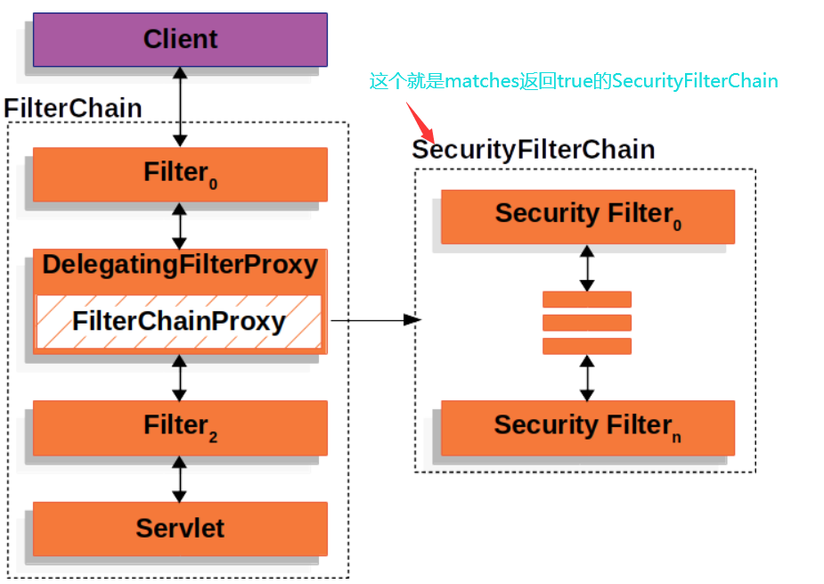

# springSecurityFilterChain

> 当我们使用springboot方式使用spring security时, springboot autoconfig会自动帮我们创建一个`springSecurityFilterChain`的bean(类型是`FilterChainProxy`) ,并将他作为`Filter`注册到`Servlet`容器.


## 追寻autoconfig的足迹

springboot到底是如何帮我们自动配置的`springSecurityFilterChain`?

以下代码均来自springboot-2.2.6.RELEASE

```java
@Configuration(proxyBeanMethods = false)
@ConditionalOnClass(DefaultAuthenticationEventPublisher.class)
@EnableConfigurationProperties(SecurityProperties.class)
// 这里会引入WebSecurityEnablerConfiguration配置
@Import({ SpringBootWebSecurityConfiguration.class, WebSecurityEnablerConfiguration.class,
		SecurityDataConfiguration.class })
public class SecurityAutoConfiguration {
	... ...
}
```

```java
@Configuration(proxyBeanMethods = false)
@ConditionalOnBean(WebSecurityConfigurerAdapter.class)
// 如果我们自己定义了springSecurityFilterChain这个bean, 此配置将无效
@ConditionalOnMissingBean(name = BeanIds.SPRING_SECURITY_FILTER_CHAIN)
@ConditionalOnWebApplication(type = ConditionalOnWebApplication.Type.SERVLET)
// @EnableWebSecurity到底是何方神圣
@EnableWebSecurity
public class WebSecurityEnablerConfiguration {

}
```

```java
@Retention(value = java.lang.annotation.RetentionPolicy.RUNTIME)
@Target(value = { java.lang.annotation.ElementType.TYPE })
@Documented
// 引入WebSecurityConfiguration配置
@Import({ WebSecurityConfiguration.class,
		SpringWebMvcImportSelector.class,
		OAuth2ImportSelector.class })
@EnableGlobalAuthentication
// EnableWebSecurity注解本质上还是Configuration
@Configuration
public @interface EnableWebSecurity {
	boolean debug() default false;
}
```

```java
@Configuration(proxyBeanMethods = false)
public class WebSecurityConfiguration implements ImportAware, BeanClassLoaderAware {
    ... 省略其他
    /**
	 * Creates the Spring Security Filter Chain
	 * @return the {@link Filter} that represents the security filter chain
	 * @throws Exception
	 */
     // 这个就是springSecurityFilterChain的bean定义 
	@Bean(name = AbstractSecurityWebApplicationInitializer.DEFAULT_FILTER_NAME)
	public Filter springSecurityFilterChain() throws Exception {
		boolean hasConfigurers = webSecurityConfigurers != null
				&& !webSecurityConfigurers.isEmpty();
		if (!hasConfigurers) {
			WebSecurityConfigurerAdapter adapter = objectObjectPostProcessor
					.postProcess(new WebSecurityConfigurerAdapter() {
					});
			webSecurity.apply(adapter);
		}
		return webSecurity.build();
	}
    ... 省略其他
}
```


## Important  concepts 

在理解`springSecurityFilterChain`的作用之前,我们先要熟悉几个

- **DelegatingFilterProxy**
- **DelegatingFilterProxyRegistrationBean**
- **FilterChainProxy**
- **SecurityFilterChain**


### **DelegatingFilterProxy**

`Filter`是`servlet`容器中的组件, 与s`pring bean`有不同的生命周期, 当我们需要`Filter`能够像`spring bean`一样注入想要的属性, 比如`Dao`,`Service`等. **DelegatingFilterProxy** 很方便的提供了这样的功能.

**DelegatingFilterProxy**是一个普通的`Filter`,会注册到`servlet`容器, 在拦截到请求时, 他会委派一个`spring bean`去处理拦截的逻辑,这个`spring bean`也是一个`Filter`实现类, 只不过他注册在`spring`容器而不是`servlet`容器.

 `DelegatingFilterProxy` **Pseudo Code** 

```java
public void doFilter(ServletRequest request, ServletResponse response, FilterChain chain) {
    // Lazily get Filter that was registered as a Spring Bean
    // For the example in DelegatingFilterProxy delegate is an instance of Bean Filter0
    Filter delegate = getFilterBean(someBeanName);
    // delegate work to the Spring Bean
    delegate.doFilter(request, response);
}
```

### DelegatingFilterProxyRegistrationBean

没有了web.xml, Springboot中的Listener Filter Servlet如何注册到servlet容器?

1. `@ServletComponentScan` 支持servlet容器标准注解@WebFilter @WebServlet @WebListener
2. springboot提供了各种`RegistrationBean`, 方便我们使用
   - Filter                    --->    FilterRegistrationBean  (**Filter的顺序有时候很重要**)
   - Servlet                --->    ServletRegistrationBean
   - Listener             --->    ServletListenerRegistrationBean
   - DelegatingFilterProxy    --->    DelegatingFilterProxyRegistrationBean

### FilterChainProxy

>  `FilterChainProxy` is a special `Filter` provided by Spring Security that allows delegating to many `Filter` instances through `SecurityFilterChain`. Since `FilterChainProxy` is a Bean, it is typically wrapped in a `DelegatingFilterProxy`

本文中的springSecurityFilterChain就是`FilterChainProxy`的实例, 它包含一个List<SecurityFilterChain>, 

doFilter时会循环这个list, 如果SecurityFilterChain.matches返回true, `FilterChainProxy`就会委派`SecurityFilterChain`来处理doFilter逻辑

### SecurityFilterChain

```java
public interface SecurityFilterChain {

	boolean matches(HttpServletRequest request);

	List<Filter> getFilters();
}
```

`SecurityFilterChain` is used by `FilterChainProxy` to determine which Spring Security `Filter`s should be invoked for this request. 



